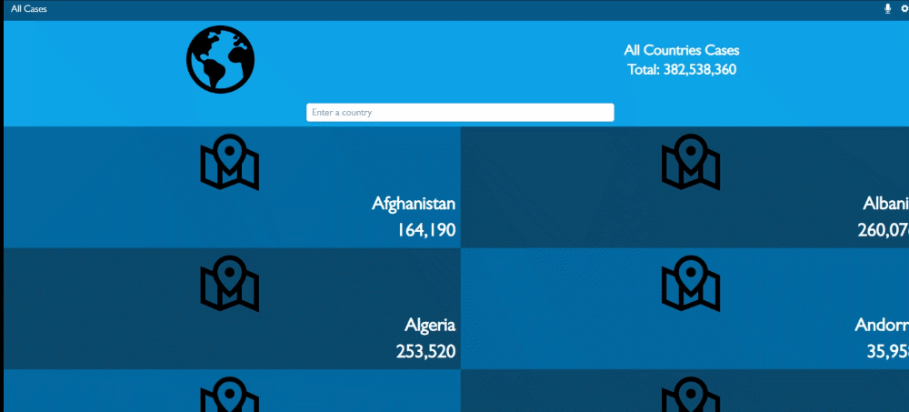

# Covid Tracker

This is a capstone solo project in react module. It's got covid cases from all
over the world. The project was built with react, redux, and fetch API.

Additional description about the project and its features.

## Built With

- HTML
- CSS
- Javascript
- Webpacks
- React
- Redux
- API

## Live Demo

[Live Demo Link](https://keen-murdock-9ac8fc.netlify.app/)

## Video Link

[Video Link](https://www.loom.com/share/8a24b74c37aa43de8e4706f12bf7af51)

## Getting Started

To get a local copy up and running follow these simple example steps:

1- Click on the top right green **`code`** button.  2- On the dropdown menu,
choose the **`download zip`** button.  3- After download, extract the zip
file and you have the project running on your machine.  4- You can also clone
the project using the **`git clone`** command.  5- After downloading or
cloning the project use the command **`npm i`** to install all Node
packages.  6- After installing the node packages use **`npm start`** to run
the project.

### Prerequisites

### Setup

### Install

- Node
- npm

### Usage

### Run tests

### Deployment

## Author

👤 **George Magdy**

- GitHub: [@George_Magdy](https://github.com/gemmen29)
- Twitter: [@George_Magdy](https://twitter.com/georgtriple1)
- LinkedIn: [@George_Magdy](https://www.linkedin.com/in/george-magdy-840/)

## 🤝 Contributing

Contributions, issues, and feature requests are welcome!

Feel free to check the [issues page](../../issues/).

## Show your support

Give a ⭐️ if you like this project!

## Acknowledgments

- This design inspired by
  [Nelson Sakwa](https://www.behance.net/sakwadesignstudio)

## 📝 License

This project is [MIT](./MIT.md) licensed.
